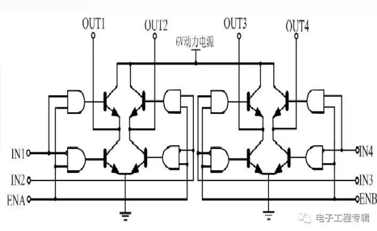

# 三极管
## NPN
发射极接地，集电极接高电平， 基极控制
## PNP
集电极接地，发射极接高电平，基极控制

## 题目
### 驱动数码管

1. PNP控制
2. 74HC138：二进制译码器，能控制$2^{3}=8$个数码管
3. RP1210：线性稳压器
4. RP1~RP7：七段数码管数据端口，接低电平，控制发光
5. 原理：74HC138输入高电平，发射极与集电极导通，数码管发光

### 驱动蜂鸣器

1. NPN控制
2. 原理同上

### 驱动继电器

1. NPN控制
2. 接通后电感吸引开关，使电路导通，二极管用于保护电路

### 恒流源

1. 电流流过$R_{f}$，使运放反相输入端电压增大
2. 同相和反相输入端电压差减小
3. 运放输出电压减小，基极电流减小，则三极端流过电流减小，实现恒流
4. [参考](https://blog.csdn.net/huxyc/article/details/126067167)

### 推挽放大器

1. 基本原理：正向输入$V_{1}$导通，推动电流通过，反向输入$V_{2}$导通，拉动电流通过
2. 当正向：$V_{out} = V_{in} - V_{BE1}$，当$V_{in}$大于$V_{BE1}$才导通
3. 反向$V_{out} = V_{in} + V_{BE2}$，当$V_{in}$小于$V_{BE2}$才导通
4. 2和3导致交叉失真
5. [参考](https://zhuanlan.zhihu.com/p/604737089)

### 交流恒流源

1. 原理：参考[恒流源](###恒流源)、[推挽放大器](###推挽放大器)
2. 作用：提供稳定交流电流输出的电源，适用于需要恒定电流输出的应用，如电阻负载测量、电机驱动等。特点是输出电流稳定，能够适应不同负载的变化，并具有较好的抗干扰性能。
3. [参考1](https://www.sohu.com/a/704788798_121674690)

### 高保真音频放大器

1. 作用：放大输入的音频信号
2. 放大倍数：$R_{3}/R_{2}=32.3$
3. $C_{1}$作用：隔直通交
4. $C_{3}, C_{5}$作用：并联用于滤波，防止噪声频率过高，超出了电容的自谐振频率，失去滤波作用
5. 二极管作用：钳位二极管，保护二极管。防止输出电压峰值损坏运放
6. 电阻串联电容$C_{7}$：消除高频干扰
7. [参考1](https://e2echina.ti.com/support/amplifiers/f/amplifiers-forum/116948/opa690)
[参考2](https://www.st.com/resource/en/datasheet/tda2030.pdf)
[参考3](https://murata.eetrend.com/content/2023/100567806.html)
[参考4](https://zhuanlan.zhihu.com/p/593674667)
[参考5](https://blog.csdn.net/weixin_42717711/article/details/81129344)
[参考6](https://zhidao.baidu.com/question/319110292.html)

### 电机驱动

1. 正转：PWM_A输入，$Q_{5}$导通，拉动$Q_{1}$，推动$Q_{4}$，实现正转
2. 反转：PWM_B输入，$\dots$
3. 负载并联电容：电机是感性负载，并联电容能提高功率因数
功率因数角$\phi$的定义为电压相量$\dot{U}$超前电流向量$\dot{I}$的角度，所以阻抗的角就是功率因数角。
$$Z\angle \phi = \frac{\dot{U}}{\dot{I}} = R + jX$$
$$cos\phi = \frac{R}{R^{2} + X^{2}}$$
电感负载并联电容后X减小，所以功率因数提高
[参考1](https://www.cw-zkb.com/news/gsxw/1057.html)
[参考2](https://www.zhihu.com/question/305161605)

### 半桥驱动IR2104

1. IR2104引脚
    |引脚|描述|
    |:--|:--|
    |$V_{CC}$|内部驱动电压源|
    |IN|输入引脚|
    |SD|关断引脚|
    |COM|接地|
    |LO|低侧栅极驱动输出|
    |HO|高侧栅极驱动输出|
    |VS|高压侧浮动电源返回|
    |VB|高端栅极驱动器浮动电源|
2. 原理：:older_man: 实在看不懂。大致流程为一个驱动交替导通一个半桥。

当Q1开通时，自举电容C1作为一个浮动的电压源驱动Q1(上桥臂MOS)，导通上桥臂；而Q2开通后，Q1关断，Vs处的浮动电源消失，C1在开通期间损失的电荷在又会得到补充。如此循环，即可控制Q1和Q2进行半桥驱动。这种自举供电方式就是利用Vs端的电平在高低电平之间不停地摆动来实现的
3. [参考](https://zhuanlan.zhihu.com/p/426519286)

### L298N原理

1. 原理：通过与门控制输出，例如当IN1为高电平，ENA的PWM波为高电平，则OUT1输出高电平
2. 二极管作用：钳位二极管，保护驱动
3. [参考](https://blog.csdn.net/DJDN426611/article/details/82769976)

### 光电二极管模型

1. 作用：用于放大光相关电流
2. $V_{ref}$作用：防止输入电流为0时输出在负电源轨处饱和
3. $C_{1},C_{2}$作用相同，滤波
4. $C_{j}$：光电二极管的结电容，是二极管的性质，一般可以忽略

### 麦克风P12

1. 